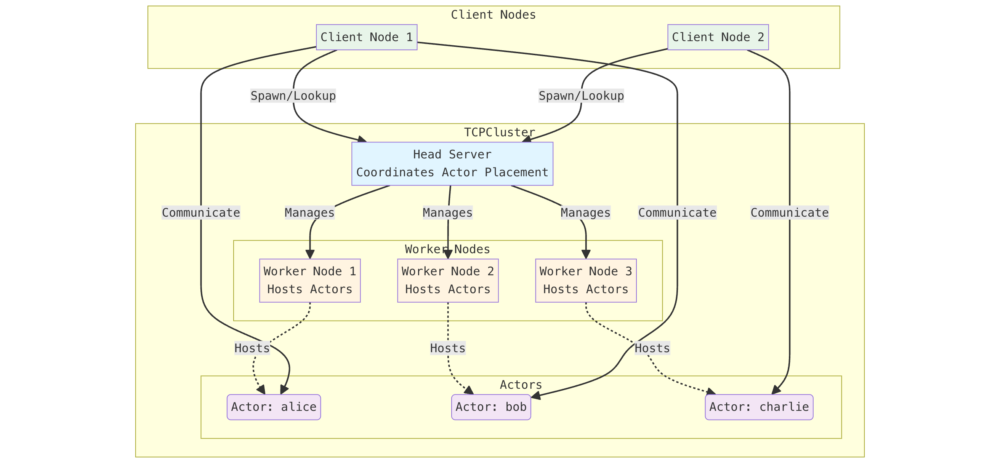
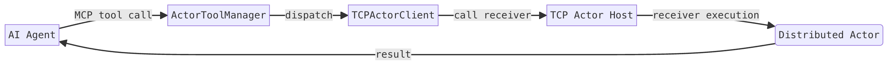
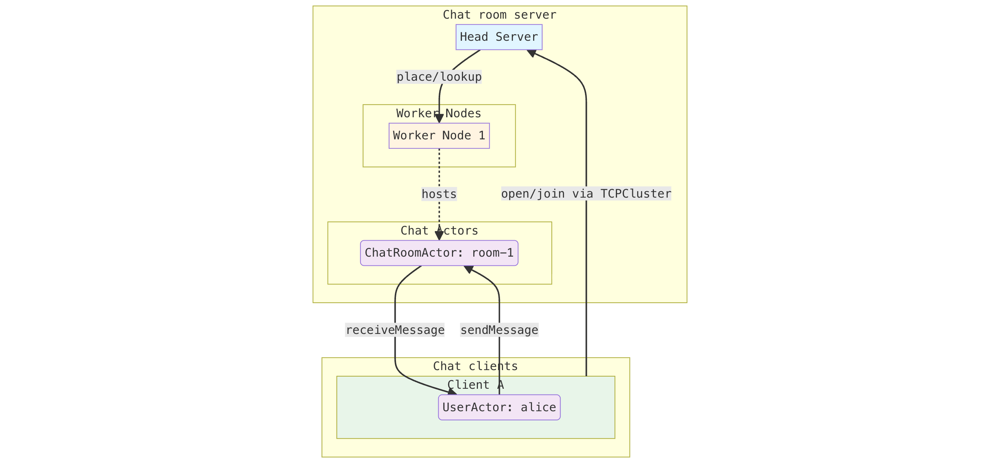

# Distributed actors

Distributed actors extend the Actor model from a single process to multiple nodes. In the Cangjie ecosystem, the [`distributed-actors-cj`](https://gitcode.com/Cangjie-SIG/distributed-actors-cj) project provides a framework to build actor-based systems where components communicate through asynchronous messages, run locally or remotely, and scale across machines.

The framework combines:

A core actor programming model with async calls and futures, distributed actor interfaces and proxies for remote invocation, a TCP-based actor system with cluster support for multi-node deployment and actor placement, and optional MCP integration so actor receivers can be exposed as tools for AI agents.

This makes distributed actors a good fit for stateful services, concurrent business workflows, and cloud-native applications that need clear isolation, resilience, and horizontal scalability.

## Clustering

Clustering lets multiple actor system nodes work as one logical runtime.

The TCPCluster provides a cluster-based distributed actor system that allows you to spawn, manage, and communicate with distributed actors across multiple worker nodes. The cluster consists of a head server that coordinates actor placement and multiple worker nodes that host the actual actors.

A TCPCluster consists of:

- **Head Server**: A central coordinator that manages actor registration, placement, and lookup across the cluster
- **Worker Nodes**: Multiple nodes that host and execute distributed actors
- **Client Nodes**: Optional nodes that can join the cluster to spawn and interact with actors without hosting them

The following diagram illustrates the cluster architecture:




## MCP integration

MCP integration connects distributed actors to AI agents by exposing actor receivers as callable tools through the Model Context Protocol. In practice, the actor system remains the source of truth for business logic, while MCP provides a standard interface that an agent can discover and invoke. This means an agent can request operations such as account transfer, room creation, or status lookup, and those requests are translated into actor receiver calls over the existing distributed actor infrastructure.

In the `distributed-actors-cj` workflow, this is typically done by creating an `ActorToolManager`, adding one or more `TCPActorClient` connections, and letting the tool manager surface compatible actor receivers as tools. MCP integration does not require a cluster: it can work with a single TCP actor host and client. If a cluster is present, the same MCP layer can call actors hosted through the cluster as well. This architecture keeps AI orchestration separate from stateful backend execution and allows the same actor services to be reused by both application code and agent-based clients.

The following diagram shows how a Model Context Protocol (MCP) AI agent/assistant request flows to distributed actor receivers in a typical system, when MCP integration is enabled:



```cangjie
let toolManager = ActorToolManager()
let tcpClient = TCPActorClient.create("localhost", 8080)
toolManager.addActorClient(tcpClient)

// Agent-side calls are routed to actor receivers exposed as MCP tools.
```


## Chat room server example

The chat room example in `distributed-actors-cj` is implemented in `examples/chat-application-example`. It uses a head server and worker nodes for clustering, and each client joins the cluster and also hosts a local `UserActorImpl` endpoint so it can receive pushed chat messages.

A room is represented by `ChatRoomActor`, which is spawnable and created with `TCPCluster.spawnActor<ChatRoomActor>(...)` when a user runs `open <room>`. When a user runs `join <room>`, the client looks up the room actor with `TCPCluster.getActor<ChatRoomActor>(...)` and registers its user actor via `joinRoom(userId, user)`. Sending text uses `sendMessage(userId, message, tell: True)`, and the room actor broadcasts by iterating stored `UserActor` proxies and calling `receiveMessage` on each one. The client-side `UserActorImpl` prints incoming messages and ignores messages sent by itself.

The architecture of the chat room server in a distributed actor cluster can be visualized as follows:



For this application, the main advantage of using an actor cluster is that each chat room has a clear ownership boundary: room membership and broadcast state live inside one `ChatRoomActor`, and all updates are serialized through actor receivers. That avoids explicit lock management for room data and makes concurrent joins, leaves, and messages easier to reason about. Clustering also provides location transparency, so clients can keep using the same proxy calls even if a room actor is placed on a different worker node, which simplifies horizontal scaling as room count and traffic grow.

Without actors, the same chat server is usually built around shared in-memory maps, manual synchronization, and connection registries spread across threads or event loops. That can work, but correctness depends on careful coordination of locks, lifecycle cleanup, and message fan-out ordering under load. Scaling across nodes then requires adding extra routing and discovery layers to answer where a room lives and how to deliver to connected users. In the actor-cluster design, those concerns are pushed into actor isolation and cluster placement/lookup, so application code stays closer to chat-domain logic instead of infrastructure plumbing.